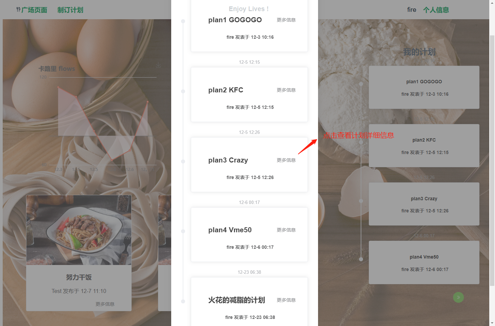
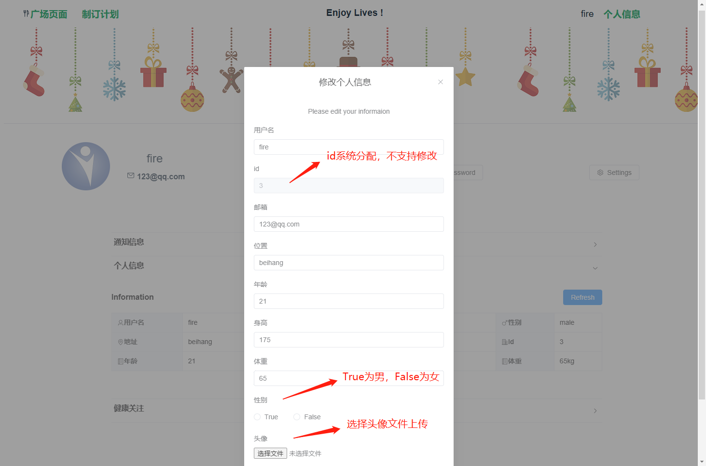

# 系统实现报告

### 5. 若干展示系统的运行说明

#### （1）用户登录/注册

通过按钮可以切换登录模式和注册模式，右侧使用走马灯装饰。

登录时，获取后端检验信息，并弹出相应的错误提示信息：

​	如用户名不存在时提示：

​	密码错误时提示：

注册时，由前端检验两次密码是否一致，有后端检验该用户名是否已存在。

​	当两次输入密码不一致，或者用户名存在时，同样会弹出错误提示信息；

​	成功注册后，会跳出对话框，可以选择登入，或者回退到登陆界面：

#### （2）广场页面：

广场页面主要实现展示用户自制计划卡路里含量信息、展示用户所有自制计划以及个性化推荐计划功能。

由于无法一次性展示所有自制计划，通过弹出框的模式实现:

#### （3）页面头header：

页面头用来实现在各个页面之间的跳转功能，以及作为页面头部存在：

#### （4）制定计划页面：

主要实现制定计划的功能，可以分解为对美食、运动的各种方式的检索。再选择过程中，亦可以查看餐厅和运动场所的详情，以增进了解。点击已选内容后会出现已选部分的信息。

在已选择部分可以完善编辑计划的基本信息，并且查看卡路里总结，点击提交计划并确定后即拥有了自己的新一个计划。

#### （5）计划页面：

计划页面主要是实现查看计划信息、评价。将鼠标指向美食或运动会显示详细的信息，计划拥有着有权限点击删除计划按钮确定删除本计划，访客没有权限删除。

评价由评论与评分构成，可以发查看其他用户的评论与评分，也可以对计划进行评价评分。

#### （6）个人页面：

个人页面主要实现包括查看修改个人信息以及健康信息的功能。

个人信息部分主要是基本信息，可以查看与修改：

在修改密码时，需要输入原密码由后端检验，两次输入新密码由前端检验，并会弹出相应的提示信息。

修改个人信息时，id为系统分配，不支持更改。

健康关注部分为系统对用户个人健康的评估与建议：

### 6. 收获与体会

​	首先要感谢数据库课程设计给予我们一次合作开发的机会，这是一个不小的挑战，也是一个提升的机遇。在组队开发的过程中，我们遇到了颇多的阻碍，但解决后都得到了很大的收获。

​	在开发前端的过程中，由于前端所使用的语言架构不同于之前学过的很多程序设计语言，所以需要从头开始系统的学习，在这个过程中，动手实践尤为重要。前端的好处在于写的程序是可以实在看到的，这个开发带来了便利，但是同样的，如何按照自己所想进行渲染也需要更多的尝试于学习。另一方面，在使用VUE开发时，我们采用了面向对象的思想，将页面分解为一个个部分，封装为组件，实行组件式开发。

​	此外，我们也深深体会到借助工具帮助协同开发的重要性。我们主要使用的协同开发工具有github、eolink，一个用来进行版本控制和代码共享，另一个用来处理公共资源和API的设计与对接。我们看着每个API从设计、实现、对接、测试一步步到完成、发布，既获得了成就感，也体会到系统规范开发的益处。

​	总而言之，真正着手进行团队开发与学习理论知识甚至自己书写程序是完全不同的体验，遇到了各种的问题困难，也想出了各种各样的解决方法，获得了不同的收获。

