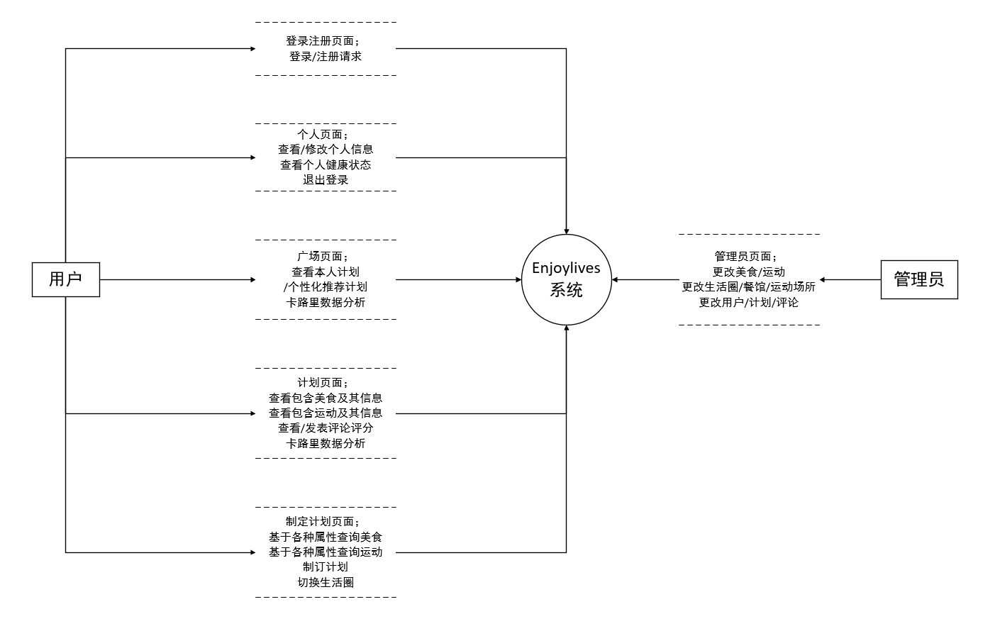
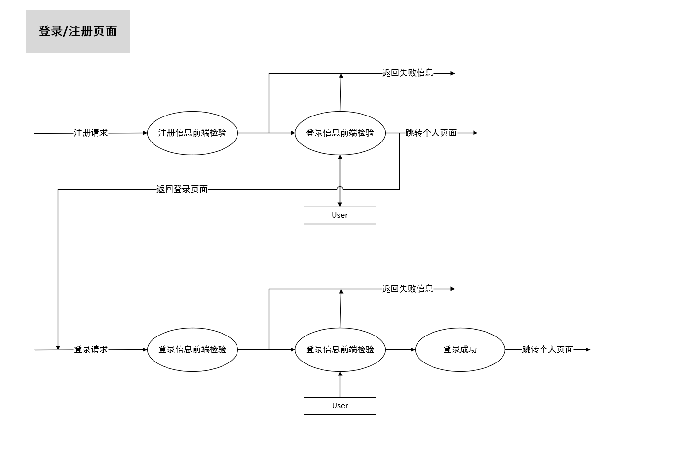
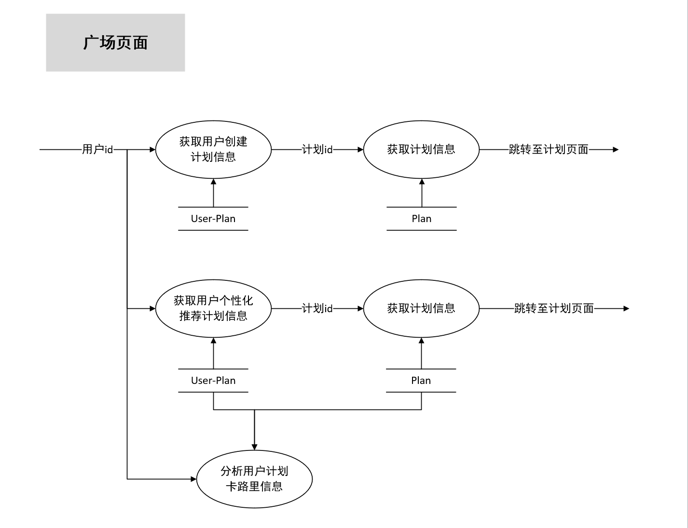
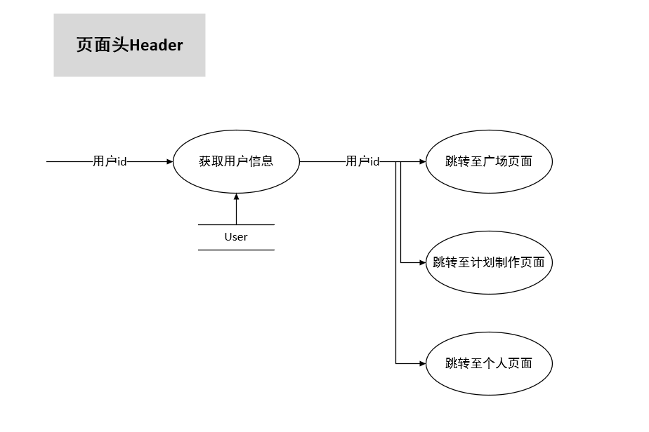
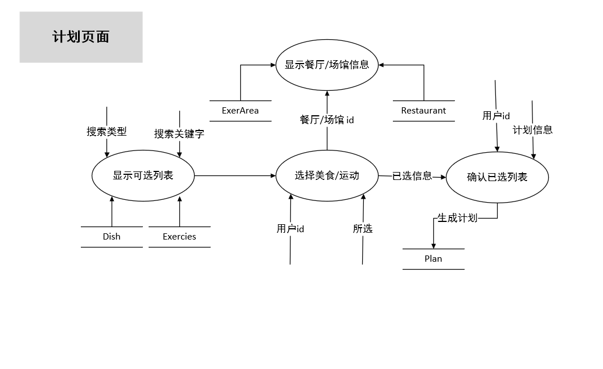
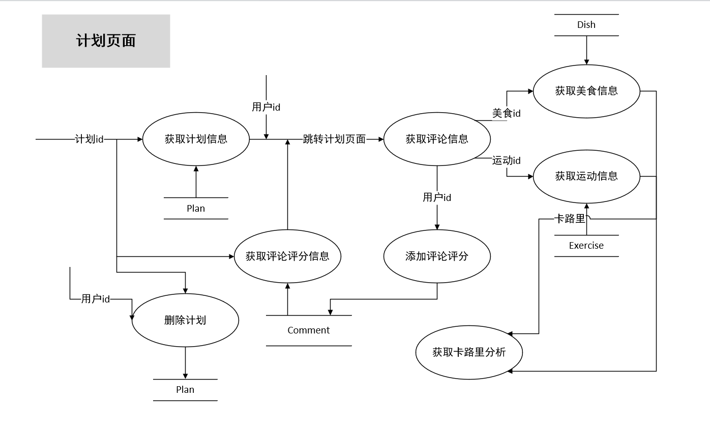
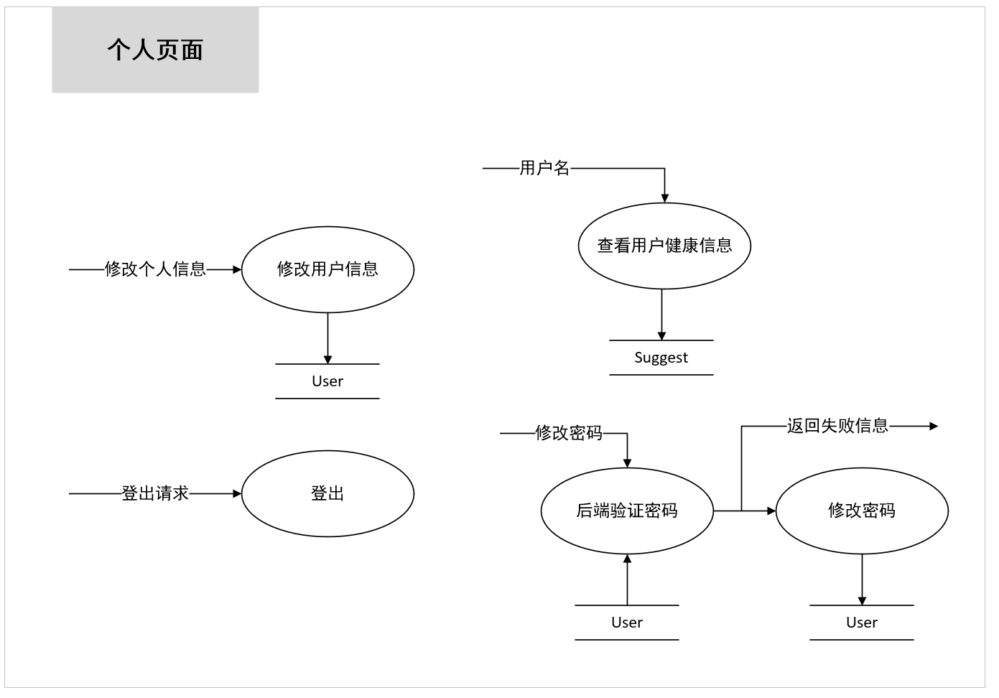

# 系统设计报告

## 一、系统需求分析

### 1. 需求分析

​	本次课程设计的 Enjoylive 健康生活计划系统，诣在帮助同学们规划、记录、追求健康的生活。主要功能为帮助记录、分享用户制定包含美食、运动的计划。用户们可以根据自身的喜好、或者根据平台的数据分析制定并发布自己的计划，也可以浏览并评论其他用户制定的计划。

​	具体功能如下：

1）个人信息修改及查看：

​	用户注册并登陆后，可以在个人主页更改自己的**用户名、性别、邮箱、年龄、体重、身高等基本信息**，并会根据信息**计算健康指数**并作出相应推荐。

2）制订计划及相关功能：

​	用户可以查看当前可选的菜品和运动并根据自己的喜好添加到选择列表中。该页面同样应该体现搜索功能，用户可以根据菜品名称、菜品种类、卡路里上限、运动难度等关键词对菜品和运动进行搜索。当用户选择完成后在选择列表可以实时查看当前选择结果，并进行删除菜品/运动，确认提交的操作。

3）总览、个性化推送与帮助：

​	在广场能够查看对自己制定的计划的统计与分析，并可以查看个性化推荐的计划。

4）计划查看及相关操作：

​	查看计划页面可以查看计划所选择的**美食与运动**，及其**详细信息**，并且有**卡路里分析**。此外，可以浏览用户对该计划的**评论与评分**，以及**发表评论并评分**。

5）管理员界面相关操作：

​	在管理员界面可以添加用户、计划、美食、运动、餐厅、运动场场所、生活圈，并添加他们之间的关系。

### 2. 数据流图

#### 1）顶层：

#### 2）登录/注册页面

#### 3）广场页面

#### 4）页面头（header）

#### 5）制订计划页面

#### 6）计划页面

#### 7）个人页面

### 3. 数据元素表

#### 1）注册请求数据组：

| 数据项名称 | 数据类型 | 约束       |
| ---------- | -------- | ---------- |
| u_name     | string   | 非空、唯一 |
| u_password | string   | 非空       |

注：在前端进行二次输入确认密码以及长度检验，在注册时系统自动分配id。

#### 2）登录请求数据组：

| 数据项名称 | 数据类型 | 约束 |
| ---------- | -------- | ---- |
| u_name     | string   | 非空 |
| u_password | string   | 非空 |

#### 3）用户个人信息数据组；

**User:**

| 数据项名称 | 数据类型 | 约束                    |
| ---------- | -------- | ----------------------- |
| u_id       | int      | 主键                    |
| u_name     | string   | 非空、唯一、maxLen = 20 |
| u_pasword  | string   | 非空、maxLen = 20       |
| u_position | string   | maxLen = 30             |
| u_gender   | boolean  | 非空                    |
| u_email    | string   |                         |
| u_age      | int      |                         |
| u_height   | int      |                         |
| u_weight   | int      |                         |
| u_photo    | Object   | File类型                |

注：u_gender 为 True 时代表男性，False 代表女性

#### 4）计划信息数据组：

**Plan:**

| 数据项名称       | 数据类型 | 约束 |
| ---------------- | -------- | ---- |
| p_id             | sint     | 主键 |
| p_name           | string   | 非空 |
| p_description    | string   |      |
| p_time           | string   |      |
| user             | User     | 外键 |
| calories_in      | int      |      |
| calories_consume | int      |      |

#### 5）评论信息数据组：

**Comment：**

| 数据项名称 | 数据类型 | 约束 |
| ---------- | -------- | ---- |
| r_id       | int      | 主键 |
| r_star     | string   |      |
| r_content  | string   | 非空 |
| r_data     | string   | 非空 |
| user       | User     | 外键 |
| plan       | Plan     | 外键 |

#### 6）美食信息数据组：

**Dish:**

| 数据项名称 | 数据类型    | 约束 |
| ---------- | ----------- | ---- |
| d_id       | int         | 主键 |
| d_name     | string      | 非空 |
| d_category | string      |      |
| d_cuisine  | string      | 非空 |
| d_calories | int         |      |
| d_price    | int         |      |
| restaurant | Restraurant | 外键 |

#### 7）运动信息数据组：

**Exercise:**

| 数据项名称    | 数据类型 | 约束 |
| ------------- | -------- | ---- |
| sp_id         | int      | 主键 |
| sp_name       | string   | 非空 |
| sp_content    | string   | 非空 |
| sp_difficulty | string   |      |
| sp_calories   | string   |      |
| sp_time       | string   |      |
| exerArea      | ExerArea | 外键 |

#### 8）计划-美食关系数据组：

**Plan-Dish:**

| 数据项名称 | 数据类型 | 约束       |
| ---------- | -------- | ---------- |
| plan       | Plan     | 主键、外键 |
| dish       | Dish     | 主键、外键 |

#### 9）计划-运动关系数据组：

**Plan-Exercise:**

| 数据项名称 | 数据类型 | 约束       |
| ---------- | -------- | ---------- |
| plan       | Plan     | 主键、外键 |
| exercise   | Exercise | 主键、外键 |

#### 10）餐厅信息数据组

**Restaurant:**

| 数据项名称     | 数据类型   | 约束 |
| -------------- | ---------- | ---- |
| re_id          | int        | 主键 |
| re_name        | string     | 非空 |
| re_category    | string     |      |
| re_description | string     |      |
| lifeCircle     | LifeCircle | 外键 |

#### 11）运动场所信息数据组：

**Exercise:**

| 数据项名称 | 数据类型   | 约束 |
| ---------- | ---------- | ---- |
| l_id       | int        | 主键 |
| l_location | string     | 非空 |
| l_time     | string     | 非空 |
| l_info     | string     |      |
| lifeCircle | LifrCircle | 外键 |

#### 12）生活圈信息数据组：

**LifeCircle:**

| 数据项名称    | 数据类型 | 约束 |
| ------------- | -------- | ---- |
| c_id          | int      | 主键 |
| c_name        | string   | 非空 |
| c_location    | string   |      |
| c_description | string   |      |

